<picture><source media="(prefers-color-scheme: dark)" srcset="assets/hero-dark.svg"></picture>

  <a href="mailto:pazylbekovoryntai@gmail.com"><picture><source media="(prefers-color-scheme: dark)" srcset="assets/btn-email-dark.svg"></picture></a>
  <a href="https://t.me/oryntaivez"><picture><source media="(prefers-color-scheme: dark)" srcset="assets/btn-telegram-dark.svg"></picture></a>

## About

I build backend services in Python and ship whole products around them. Most of my recent work puts LLMs to work inside real products.

- **Backend:** FastAPI and Django, PostgreSQL, Redis and queues, Docker, CI/CD
- **AI integrations:** agents with tools, RAG with citations, MCP servers
- **End to end:** API and database, web and mobile clients, deployment

<a href="https://oqcrm.kz"><picture><source media="(prefers-color-scheme: dark)" srcset="assets/oqcrm-dark.svg">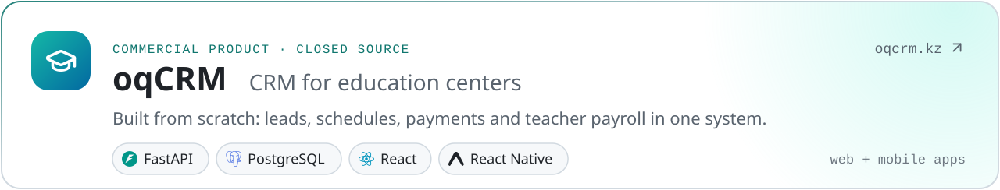</picture></a>

## Featured projects

  <a href="https://github.com/Oryntai/AgentLink"><picture><source media="(prefers-color-scheme: dark)" srcset="assets/card-agentlink-dark.svg">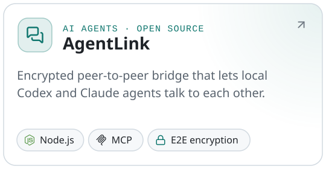</picture></a>
  <a href="https://github.com/Oryntai/tribal-observer"><picture><source media="(prefers-color-scheme: dark)" srcset="assets/card-observer-dark.svg">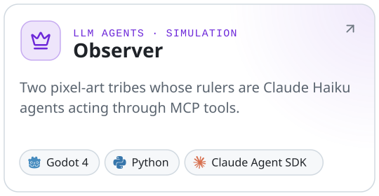</picture></a>
  <a href="https://github.com/Oryntai/SalyqAI"><picture><source media="(prefers-color-scheme: dark)" srcset="assets/card-salyq-dark.svg">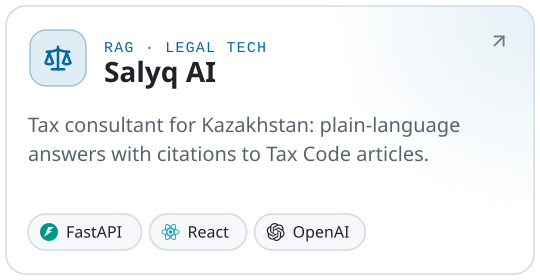</picture></a>
  <a href="https://github.com/Oryntai/Diploma"><picture><source media="(prefers-color-scheme: dark)" srcset="assets/card-iot-dark.svg">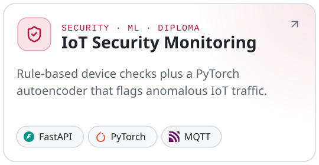</picture></a>

  <a href="https://github.com/Oryntai/BrainCanvas"><picture><source media="(prefers-color-scheme: dark)" srcset="assets/card-braincanvas-dark.svg">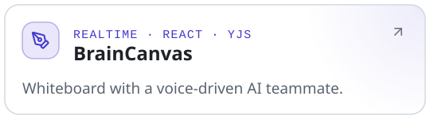</picture></a>
  <a href="https://github.com/Oryntai/DataSaur2026"><picture><source media="(prefers-color-scheme: dark)" srcset="assets/card-fire-dark.svg">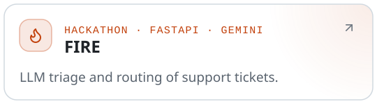</picture></a>
  <a href="https://github.com/Oryntai/browser-agent"><picture><source media="(prefers-color-scheme: dark)" srcset="assets/card-browser-agent-dark.svg">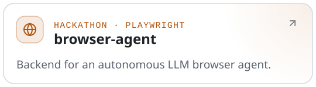</picture></a>
  <a href="https://github.com/Oryntai/handstick"><picture><source media="(prefers-color-scheme: dark)" srcset="assets/card-handstick-dark.svg">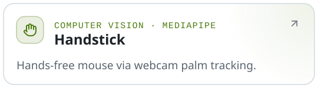</picture></a>

BrainCanvas has a <a href="https://ai-brainstorm-canvas.fly.dev">live demo</a> · Also contributed to <a href="https://github.com/amanai-kz/aman-ai">Aman AI</a>, a medical AI platform

## Stack

<picture><source media="(prefers-color-scheme: dark)" srcset="assets/stack-dark.svg">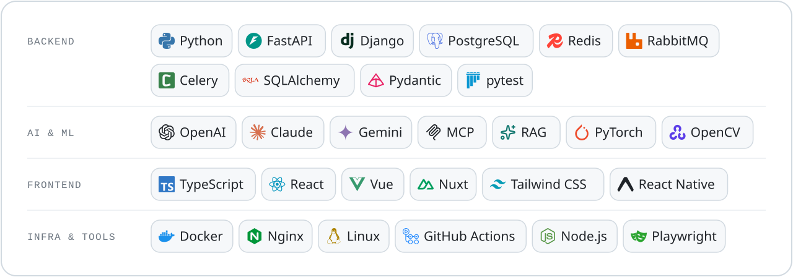</picture>

## Activity

<picture><source media="(prefers-color-scheme: dark)" srcset="assets/stats-dark.svg">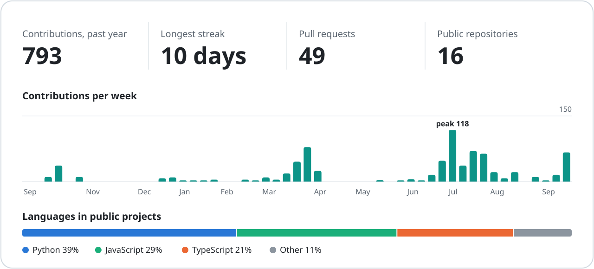</picture>

## Experience & education

<picture><source media="(prefers-color-scheme: dark)" srcset="assets/timeline-dark.svg">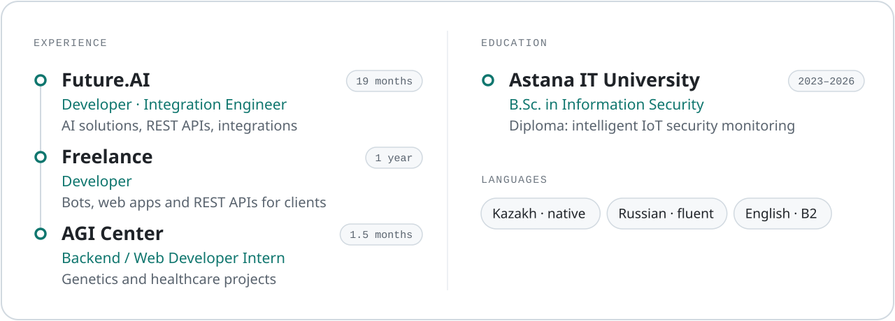</picture>

<b>По-русски</b>

 

Python-бэкенд-разработчик из Астаны. Пишу сервисы на FastAPI и Django и довожу продукты до конца: API и база, веб и мобильный клиент, деплой. Последнее время в основном встраиваю LLM в реальные продукты: агенты с инструментами, RAG с цитатами, MCP-серверы.

С нуля написал oqCRM, коммерческую CRM для учебных центров (FastAPI, PostgreSQL, React, Expo). Выпускник Astana IT University по специальности «Информационная безопасность» (2026).

Связь: [pazylbekovoryntai@gmail.com](mailto:pazylbekovoryntai@gmail.com) · Telegram [@oryntaivez](https://t.me/oryntaivez)

<!-- The SVGs in assets/ come from scripts/readme_assets.py; stats-*.svg is refreshed daily by .github/workflows/profile-stats.yml -->
