  

  <b>Backend developer (Python) · AI integration engineer</b> 
  Astana, Kazakhstan

  
  

## About

I build backend services in Python (FastAPI, Django) and take products all the way through: API and database, web and mobile clients, deployment. Most of my recent work puts LLMs into real products: agents with tools, RAG with citations, MCP servers.

**oqCRM** is the biggest thing I've built so far: a commercial CRM for education centers (music schools, language courses, tutoring centers), written from scratch. Leads, schedules, payments and teacher payroll live in one system. FastAPI + PostgreSQL backend, React web app, React Native (Expo) mobile app. Closed source, live at [oqcrm.kz](https://oqcrm.kz).

## Projects

| Project | What it does | Stack |
|---|---|---|
| [**AgentLink**](https://github.com/Oryntai/AgentLink) | Encrypted peer-to-peer link that lets local Codex and Claude agents talk to each other, no model API required | Node.js · MCP · WebSocket |
| [**Observer**](https://github.com/Oryntai/tribal-observer) | Pixel-art simulation of two tribes whose rulers are Claude Haiku agents acting through MCP tools | Godot 4 · Python · Claude Agent SDK |
| [**Salyq AI**](https://github.com/Oryntai/SalyqAI) | Tax consultant for Kazakhstan: plain-language answers with citations to Tax Code articles | FastAPI · React · ChromaDB · OpenAI |
| [**IoT Security Monitoring**](https://github.com/Oryntai/Diploma) | Diploma project: rule-based device checks plus a PyTorch autoencoder that flags anomalous IoT traffic | FastAPI · PyTorch · MQTT |
| [**BrainCanvas**](https://github.com/Oryntai/BrainCanvas) · [demo](https://ai-brainstorm-canvas.fly.dev) | Collaborative whiteboard with a voice-activated AI teammate that sees and edits the canvas | React · tldraw · Yjs · OpenAI |
| [**FIRE**](https://github.com/Oryntai/DataSaur2026) | Hackathon: LLM triage of customer support tickets and routing to the right manager | FastAPI · PostgreSQL · Gemini |
| [**browser-agent**](https://github.com/Oryntai/browser-agent) | Hackathon: backend for an autonomous LLM agent that drives a real browser | FastAPI · Playwright · SSE |
| [**Handstick**](https://github.com/Oryntai/handstick) | Hands-free mouse: webcam palm tracking with a gesture toggle | Python · MediaPipe · OpenCV |

Also contributed to [Aman AI](https://github.com/amanai-kz/aman-ai), a medical AI platform: consultation reports, PDF export, lab results parsing (RU/KZ).

## Experience

**Future.AI**, Developer / Integration Engineer · 19 months 
AI solutions and backend services, REST API design, integrations with external APIs, process automation.

**Freelance**, Developer · 1 year 
Business bots, web apps, REST APIs and websites for clients, from spec to production.

**AGI Center**, Backend/Web Developer Intern · 1.5 months 
Frontend and backend tasks on genetics and healthcare projects.

## Stack

<!-- assets/stack.svg is a snapshot of https://skillicons.dev/icons?i=py,fastapi,django,postgres,redis,rabbitmq,docker,nginx,linux,githubactions,ts,nodejs,react,vue,nuxtjs,tailwind,pytorch,opencv&perline=9 -->

**AI:** OpenAI, Claude (Agent SDK, MCP), Gemini · RAG with ChromaDB · browser agents with Playwright 
**Also:** SQLAlchemy, Alembic, Pydantic, Celery, pytest, React Native (Expo)

## GitHub

<!-- profile/*.svg are rendered daily by .github/workflows/profile-cards.yml -->
 

## Education

**Astana IT University**, B.Sc. in Information Security, 2023–2026 
Diploma: [an intelligent system for monitoring the security of IoT devices](https://github.com/Oryntai/Diploma)

**Languages:** Kazakh (native), Russian (fluent), English (B2)

<b>По-русски</b>

 

Python-бэкенд-разработчик из Астаны. Пишу сервисы на FastAPI и Django и довожу продукты до конца: API и база, веб и мобильный клиент, деплой. Последнее время в основном встраиваю LLM в реальные продукты: агенты с инструментами, RAG с цитатами, MCP-серверы.

С нуля написал oqCRM, коммерческую CRM для учебных центров (FastAPI, PostgreSQL, React, Expo). Выпускник Astana IT University по специальности «Информационная безопасность» (2026).

Связь: [pazylbekovoryntai@gmail.com](mailto:pazylbekovoryntai@gmail.com) · Telegram [@oryntaivez](https://t.me/oryntaivez)

